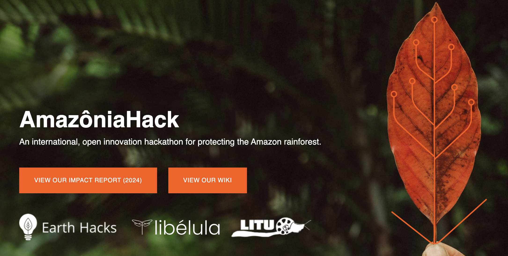

# AmazoniaHack 4.0 – Sofia Sarak



The following repository houses my submission to the AmazionaHack 4.0 hackathon, which took place September 12-13, 2026. I opted to address Challenge 3, which is described as follows in the hackathon's documentation:

*The challenge is to explore approaches for offline routing across the Amazon's unofficial road network that does not exist in Google Maps or official cartography, so agents can reach inspection sites without connectivity. This is deliberately exploratory: approaches that improve the map rather than the routing are equally welcome. One route to this, among others, is to build on satellite imagery together with the unofficial road network that PrevisIA derives, provided as a sample of identified road stretches.*

I addressed the issue of routing during rainy seasons. In doing so, I developed a function that weighs potential routes between Point A and Point B differently based on if 1) the path crosses a river and 2) the surface of the road (with the assumption that unpaved roads are more prone to flooding). The study site was the Paragominas, a municipality in the northeastern part of the state of Pará, Brazil.

## Repository Structure
```
├── avoid_rivers_func.ipynb
├── challenge-docs # provided by AmazonaHack 4.0 team -- EXCLUDED FROM REPO
│   ├── challenge-3
│   │   ├── README.md
│   │   ├── roads-osm-paragominas.geojson
│   │   ├── roads-previsia-2025-paragominas.geojson
│   │   └── test-pairs.csv
│   ├── README.md
│   └── schema.md
├── LICENSE
├── my-data # river data downloaded from FBDS
│   ├── para
│   │   ├── PA_1505502_RIOS_SIMPLES.shp
│   │   └── PA_1505502_RIOS_SIMPLES.shx
├── README.md
└── scratch # exploratory files
│   ├── exploration.ipynb
│   └── river_geoms.ipynb
└── images # amazoniahack image for README
└── requirements.txt # Python env specs
```
## Use Guidelines

The Jupyter notebook `avoid_rivers_func.ipynb` contains all the necessary code for my submission. Python environment dependencies are attached in the `requirements.txt` file. Necessary data is listed in the repository structure, but not provided in this repository due to file size.

## Data Sources
- **Road geometries:** OpenStreetMap (OSM) and PrevisIA, provided by AmazoniaHack 4.0 team
- **River geometries:** [Fundação Brasileira para o Desenvolvimento Sustentável (FBDS)](https://geo.fbds.org.br/PA/PARAGOMINAS/HIDROGRAFIA/), for the Paragominas region
- **Test pairs:** Start and end points to test for routing (provided by AmazoniaHack 4.0)

### Background information
- On Paragominas precipiation: [WeatherSpark](https://weatherspark.com/y/30245/Average-Weather-in-Paragominas-Par%C3%A1-Brazil-Year-Round)
- On flooding in the Amazon generally: [WWF](https://wwf.panda.org/discover/knowledge_hub/where_we_work/amazon/about_the_amazon/ecosystems_amazon/floodplain_forests/)

## Acknowledgements

Thank you to the AmazoniaHack team for having me! More info can be found here: [https://amazoniahack.co/] and their [wiki](https://wiki.amazoniahack.co/wiki/Welcome_to_Amaz%C3%B4niaHack).

Starting data (particularly OpenStreetMap and PrevisIA routes) and documentation were provided by the AmazoniaHack team, as well.
